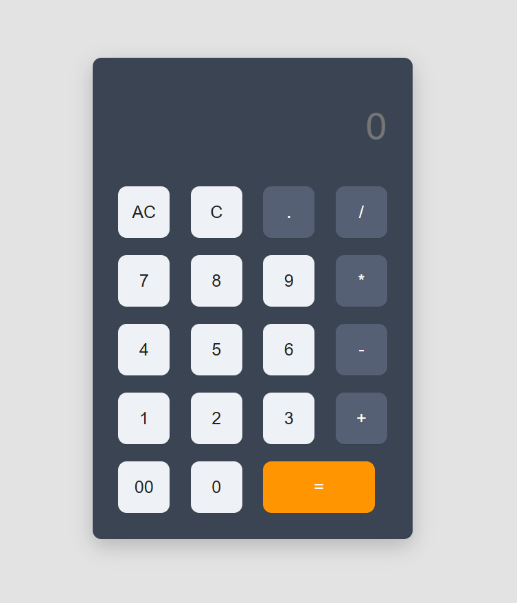

# 🧮 Calculator

A minimal and responsive calculator built with **HTML**, **CSS**, and **JavaScript**.
This project demonstrates clean UI structure, keyboard support, and efficient event-driven calculation handling.

---

## 🌐 Preview

<!-- Replace with your actual image -->



---

## ⚙️ Install

No dependencies required — works directly in your browser.

```bash
# Clone this repository
git clone https://github.com/osmantazeoglu/My-Projects.git
cd Calculator
open index.html
```

---

## 💡 Features

* 🧩 Basic operations: `+`, `−`, `×`, `÷`
* 🔢 Double-zero (`00`) support
* ⚙️ Decimal input (`.`)
* 🧼 `C` = Clear one, `AC` = Clear all
* ✅ `=` evaluates the expression
* ⌨️ Full keyboard input mapping
* 🎨 Responsive, mobile-friendly UI

---

## 🧱 Project Structure

```
Calculator/
├── index.html
├── styles.css
├── script.js
└── images/
```

---

## 🧩 HTML Snippet

Defines calculator buttons and layout.

```html
<!-- Partial snippet from index.html -->
<div class="calculator">
  <form onsubmit="return false">
    <div class="display">
      <input type="text" name="display" placeholder="0" autocomplete="off">
    </div>
    <div>
      <input type="button" value="AC" class="Clear btn">
      <input type="button" value="C" class="Del btn">
      <input type="button" value="." class="btn operator">
      <input type="button" value="/" class="btn operator">
    </div>
    <div>
      <input type="button" value="7" class="btn">
      <input type="button" value="8" class="btn">
      <input type="button" value="9" class="btn">
      <input type="button" value="*" class="btn operator">
    </div>
    <div>
      <input type="button" value="=" class="eql btn">
    </div>
  </form>
</div>
```

---

## 🎨 CSS Theme (Excerpt)

Focuses on color scheme, spacing, and interaction design.

```css
:root {
  --bg: #e3e3e3;
  --panel: #3a4452;
  --text: #ffffff;
  --btn-bg: #eef1f5;
  --btn-text: #222222;
  --op-bg: #556074;
  --accent: #ff9500;
  --radius: 10px;
  --space: 10px;
}

.calculator {
  background-color: var(--panel);
  padding: 20px;
  border-radius: var(--radius);
  box-shadow: 0 8px 24px rgba(0,0,0,0.2);
}

.btn {
  background-color: var(--btn-bg);
  color: var(--btn-text);
  transition: background-color 120ms ease, transform 80ms ease;
}
.btn.operator { background-color: var(--op-bg); color: var(--text); }
.eql.btn { background-color: var(--accent); color: var(--text); }
```

---

## ⚙️ JavaScript Logic

### 🧠 Input Handling

Maps keyboard and button inputs to calculator actions.

```js
const display = document.querySelector('input[name="display"]');
const buttons = document.querySelectorAll(".btn");

const operators = ["+", "-", "*", "/", "."];

const keyMap = {
  0: "0", 
  1: "1", 
  2: "2", 
  3: "3",
  4: "4", 
  5: "5", 
  6: "6", 
  7: "7",
  8: "8", 
  9: "9", 
  "+": "+", 
  "-": "-",
  "*": "*", 
  "/": "/", 
  ".": ".", 
  Enter: "=",
  Delete: "AC", 
  Backspace: "C",
};

document.addEventListener("keydown", (event) => {
  if (document.activeElement === display) return;
  const mappedKey = keyMap[event.key];
  const btn = Array.from(buttons).find(b => b.value === mappedKey);
  if (btn) {
    btn.click();
    event.preventDefault();
  }
});
```

---

### ⚡ Calculation Logic

Handles clearing, deletion, and mathematical evaluation.

```js
buttons.forEach((button) => {
  button.addEventListener("click", () => {
    const value = button.value;

    if (value === "AC") {
      display.value = "";
    } else if (value === "C") {
      display.value = display.value.slice(0, -1);
    } else if (value === "=") {
      try {
        display.value = eval(display.value);
      } catch {
        display.value = "Error";
      }
    } else {
      const lastChar = display.value.slice(-1);
      if (!(operators.includes(value) && operators.includes(lastChar))) {
        display.value += value;
      }
    }

    display.scrollLeft = display.scrollWidth;
  });
});
```

---

## 🧠 Example Usage

```text
12 + 8 = 20
9 × 3 = 27
5.7 + 8.5 = 14.2
50 ÷ 2 = 25
```

---

## 📄 License

This project is licensed under the **MIT License**.
