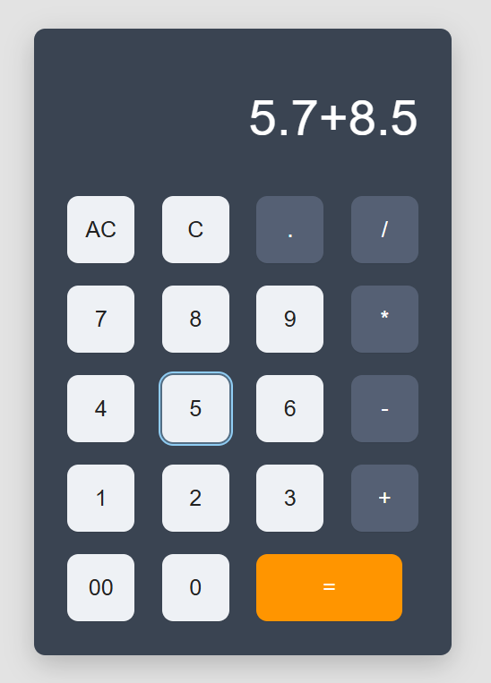
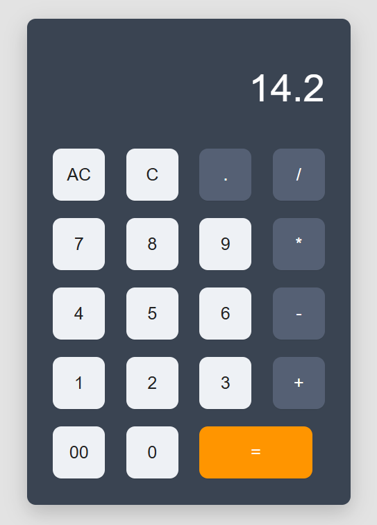

<h1 align="center">🧮 Calculator</h1>

<p align="center">
  <b>A clean, responsive, and functional calculator built with HTML, CSS, and JavaScript.</b><br>
  <i>Perform basic arithmetic operations just like a classic calculator — lightweight and elegant.</i>
</p>

<p align="center">
  
  
  
</p>

---

## 🌐 Preview

<p align="center">
  <!-- 📸 Add a full screenshot of the calculator UI here -->
  
  <br>
  <i>Full interface view with all buttons visible</i>
</p>

---

## ⚙️ Installation

<details>
<summary>Click to expand</summary>

```bash
# Clone this repository
git clone https://github.com/osmantazeoglu/My-Projects/tree/master/Calculator

# Navigate into the folder
cd Calculator

# Open index.html in your browser
```

Or simply drag the `index.html` file into your web browser to start using the calculator.

</details>

---

## 💡 Features

✅ Digits **0–9** and **00**
✅ Arithmetic operations: **+**, **−**, **×**, **÷**
✅ **Decimal point (.)** for floating numbers
✅ **C** button → clears the last entry
✅ **AC** button → resets the screen
✅ **=** button → computes the expression
✅ Responsive design for all screen sizes
✅ Clean and modular JavaScript logic

---

## 🧠 Usage

<details>
<summary>See examples</summary>

```text
Example 1: 12 + 8 = 20
Example 2: 9 × 3 = 27
Example 3: 5.5 + 4.5 = 10
Example 4: 50 ÷ 2 = 25
```

</details>

<p align="center">
  <!-- 📸 Add a screenshot showing an operation result -->
  
  
  <br>
  <i>Example: Displaying the result of 5.7 + 8.5 = 14.2</i>
</p>

---

## 🧩 Project Structure

```bash
Calculator/
├── index.html        # Main structure of the calculator
├── style.css         # Styling and layout
├── script.js         # Logic and event handling
└── images/           # Folder for screenshots or icons
```

---

## 🖼️ Additional Previews

<p align="center">
  <!-- 📸 Add screenshot showing C and AC functionality -->
  
  <br>
  <i>Showcase: Clearing entries with C or AC button</i>
</p>

---

## 🧱 Technologies Used

| Technology           | Description                      |
| -------------------- | -------------------------------- |
| **HTML5**            | Structure and layout             |
| **CSS3**             | Styling and design               |
| **JavaScript (ES6)** | Functionality and event handling |

---

## 🤝 Contributing

<details>
<summary>How to contribute</summary>

Contributions are welcome! Follow these steps:

```bash
# Fork the project
# Create a new branch
git checkout -b feature-name

# Make your changes
git commit -m "Add new feature"

# Push your branch
git push origin feature-name
```

Then open a pull request on GitHub.

</details>

---

## 📄 License

This project is licensed under the **MIT License**.
See the [LICENSE](./LICENSE) file for full details.

---

## ⭐ Support

If you find this project helpful, please consider giving it a **⭐ star** on GitHub — it means a lot!

---
