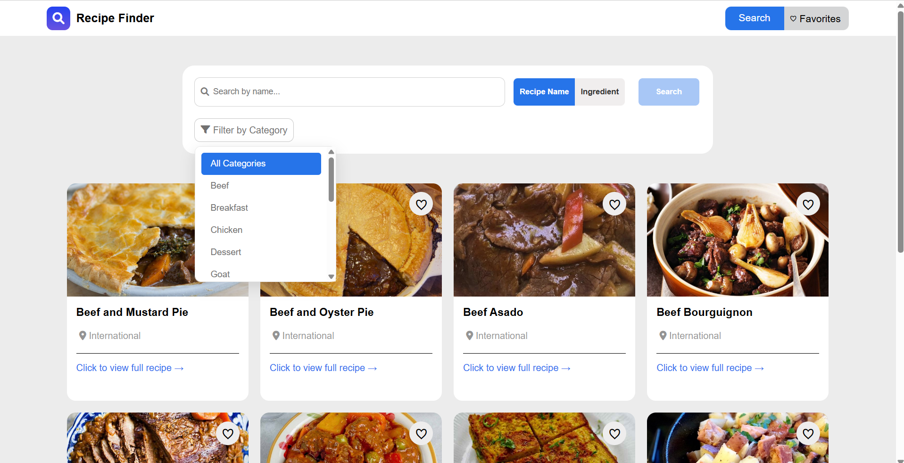

# 🍲 Recipe Finder

A modular JavaScript web app that allows users to search, filter, and
view recipes.\
Built with **HTML**, **CSS**, and **Vanilla JavaScript (ES6 modules)**.

------------------------------------------------------------------------

## 📸 Preview



> Example screenshot of the Recipe Finder interface.

------------------------------------------------------------------------

## ⚙️ Setup (Local server recommended)

Clone the repo:

``` bash
git clone https://github.com/osmantazeoglu/My-Projects.git
cd "My-Projects/Recipe Finder"
```

Run a simple local server (recommended, because the project uses ES
modules):

``` bash
# Python 3
python -m http.server 5500

# or (if you have Node installed)
npx serve .
```

Then open: <http://localhost:5500> in your browser.

> **Note:** Opening `index.html` via `file://` may cause module import /
> CORS errors in some browsers.

------------------------------------------------------------------------

## ✨ Features

-   **Search by recipe name or ingredient**\
-   **Category filtering with custom dropdown UI**\
-   **Favorites interaction** (currently alerts only --- can be extended
    to localStorage)\
-   **Dynamic rendering** via a simple `store` subscription model\
-   **Clean, modular structure** with ES6 imports

------------------------------------------------------------------------

## 📂 Project Structure

    Recipe Finder/
    ├── index.html
    ├── bodystyle.css
    ├── recipecard.css
    ├── script.js
    ├── recipecard.js
    └── store.js

-   **index.html** → main layout\
-   **bodystyle.css** → general layout and navbar/input styling\
-   **recipecard.css** → recipe card and grid styling\
-   **script.js** → app logic (state, rendering, filtering, dropdown,
    search)\
-   **recipecard.js** → recipe data and `createRecipeCard` function\
-   **store.js** → simple state manager (`subscribe`, `update`, `data`)

------------------------------------------------------------------------

## 🧩 HTML Components

Search input and filter buttons:

``` html
<div class="input-part">
  <i id="input-icon" class="fas fa-search"></i>
  <input type="text" id="search-input" placeholder="Search by name...">
</div>
<div class="buttons">
  <button id="recipe-name">Recipe Name</button>
  <button id="ingredient">Ingredient</button>
  <div class="search-btn">
    <button id="search-btn" disabled>Search</button>
  </div>
</div>
```

------------------------------------------------------------------------

## 🎨 CSS Highlights

-   **Custom dropdown styles** with hover and active state:

    ``` css
    .custom-dropdown-item.active-category {
        background-color: rgb(38, 116, 233);
        color: white;
        border-radius: 5px;
    }
    ```

-   **Responsive grid** for recipe cards
    (`auto-fill, minmax(300px, 1fr)`).

------------------------------------------------------------------------

## 🧠 JavaScript --- Core Logic

The app uses a simple reactive `store` for state management.

``` js
store.subscribe(newState => {
    renderCategory(newState);
    renderRecipes(newState);
});
```

-   `store.update({ key: value })` updates state and triggers
    subscribers\
-   `store.data` holds current state (`searchText`,
    `activeFilterButton`, `selectedCategory`, etc.)

### Category Renderer

``` js
function renderCategory(newState) {
    if (newState.selectedCategory === 'All Categories') return;
    // Render selected category UI
}
```

### Recipe Card Generator

``` js
export function createRecipeCard(recipe) {
    const card = document.createElement('div');
    card.classList.add('recipe-card');
    card.innerHTML = `
        <div class="recipe-images"></div>
        <div class="recipe-info">
            <h3 class="recipe-title">${recipe.title}</h3>
        </div>
    `;
    return card;
}
```

------------------------------------------------------------------------

## 🔄 Example Flow

1.  User selects **Ingredient** → input placeholder updates.\
2.  Types `"chicken"` → search button becomes active.\
3.  Clicks `Search` → recipes are filtered and displayed.\
4.  Category selection further refines results.\
5.  Clicking ♡ on a card triggers **"Added to favorites"** alert.

------------------------------------------------------------------------

## ⚠️ Known Issues

-   Some sample recipes in `recipecard.js` contain duplicate `id` values
    (should be unique).\
-   Opening the app directly (`file://`) may fail due to module import
    rules. Use a local server.\
-   Favorites are not persisted (alert only). Use `localStorage` for
    persistence.

------------------------------------------------------------------------

## 🤝 Contributing

-   Open an issue first for significant changes.\
-   Fork the repo, create a feature branch, then open a PR.\
-   Keep code style consistent (ES6 modules, no globals).

------------------------------------------------------------------------

## 📜 License

Licensed under the **MIT License**.\
See the [LICENSE](./LICENSE) file for details.

------------------------------------------------------------------------

## ⭐ Support

If you like this project, please ⭐ it on GitHub!\
Contributions and suggestions are always welcome.
