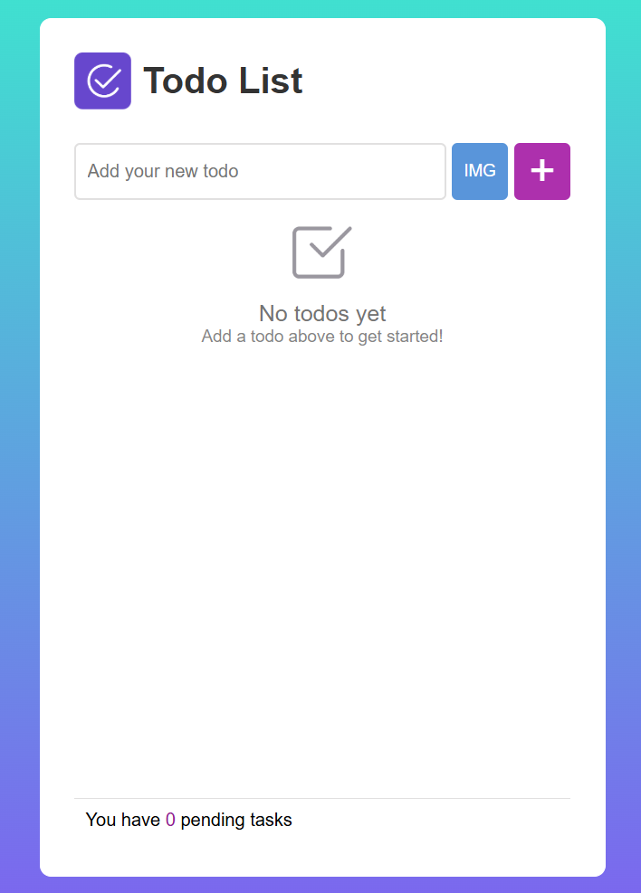

# ✅ Todo List

A modern, image-supported **To-Do List App** built with **HTML**,
**CSS**, and **JavaScript (OOP)**.\
It allows adding, editing, and deleting tasks --- with optional image
attachments for each item.

------------------------------------------------------------------------

## 🌐 Preview



> Example screenshot of the Todo List app.\
> *(If the image does not load, ensure `images/todo-ui.png` exists in
> the repo.)*

------------------------------------------------------------------------

## ⚙️ Setup

No dependencies required --- works directly in your browser.

``` bash
# Clone this repository
git clone https://github.com/osmantazeoglu/My-Projects.git
cd "My-Projects/Todo List"
```

Then open **index.html** in any modern browser (double-click or drag
into the browser).

------------------------------------------------------------------------

## 💡 Features

-   ✏️ Add, edit, delete todos
-   🖼 Attach images to tasks
-   🧮 Real-time task count and plural text update
-   🧹 "Clear All" feature
-   🪶 Smooth empty-state placeholder
-   📱 Responsive, accessible UI

------------------------------------------------------------------------

## 🧱 Project Structure

    Todo List/
    ├── index.html
    ├── styles.css
    ├── script.js
    └── images/

------------------------------------------------------------------------

## 🧩 HTML Snippet

Defines the structure of the main UI --- title, input area, list, and
footer.

``` html
<main class="container">
  <header class="title">
    <div class="todoicon">
      
    </div>
    <h1>Todo List</h1>
  </header>

  <section class="input-area">
    <input type="text" id="todoinput" placeholder="Add your new todo">
    <label for="imginp" id="imgbtn">IMG</label>
    <input type="file" accept="image/*" id="imginp">
    <button id="addbtn">+</button>
  </section>

  <ul id="todolist"></ul>

  <footer class="last">
    <p>You have <span id="taskcount">0</span> pending <span id="veriabletext">tasks</span></p>
    <button id="clearbtn">Clear All</button>
  </footer>
</main>
```

------------------------------------------------------------------------

## 🎨 CSS Theme (Excerpt)

``` css
:root {
  --brand-purple: rgb(173, 48, 173);
  --brand-blue: rgb(63, 132, 221);
  --success: #2fc953;
  --danger: rgb(236, 76, 76);
  --surface: #f0eded;
  --text: #333;
  --radius-l: 10px;
}

body {
  background: linear-gradient(to bottom, turquoise, slateblue);
  display: flex;
  justify-content: center;
  align-items: center;
  height: 100vh;
}

.container {
  background-color: white;
  max-width: 500px;
  padding: 30px;
  border-radius: var(--radius-l);
  box-shadow: 0 4px 16px rgba(0,0,0,0.1);
}
```

------------------------------------------------------------------------

## ⚙️ JavaScript Logic

### 🧠 Core Class Structure

Encapsulates all functionality inside a single `TodoApp` class.

``` js
class TodoApp {
  constructor() {
    this.todoList = document.getElementById('todolist');
    this.textInput = document.getElementById('todoinput');
    this.addBtn = document.getElementById('addbtn');
    this.clearBtn = document.getElementById('clearbtn');
    this.taskCountSpan = document.getElementById('taskcount');
    this.fileInput = document.getElementById('imginp');
    this.selectedImage = null;
    this.initializeEmptyState();
    this.bindGlobalEvents();
    this.updateTaskCount();
  }
}
```

------------------------------------------------------------------------

### 🪄 Input & Event Handling

``` js
bindGlobalEvents() {
  this.addBtn.addEventListener('click', () => this.addTodo());
  this.textInput.addEventListener('keypress', (event) => {
    if (event.key === 'Enter') this.addTodo();
  });
  this.clearBtn.addEventListener('click', () => {
    this.todoList.innerHTML = '';
    this.updateTaskCount();
  });
  this.fileInput.addEventListener('change', (e) => this.handleAddImageFromHeader(e));
}
```

------------------------------------------------------------------------

### 🧾 Adding & Managing Todos

``` js
addTodo() {
  const todoText = this.textInput.value.trim();
  if (todoText === '' && !this.selectedImage) {
    alert('Please add text or select an image!');
    return;
  }

  const listItem = document.createElement('li');
  const textSpan = document.createElement('span');
  textSpan.textContent = todoText;
  listItem.appendChild(textSpan);

  const deleteButton = document.createElement('button');
  deleteButton.textContent = 'x';
  deleteButton.classList.add('dlt-btn');
  deleteButton.addEventListener('click', () => {
    this.todoList.removeChild(listItem);
    this.updateTaskCount();
  });

  listItem.appendChild(deleteButton);
  this.todoList.appendChild(listItem);
  this.textInput.value = '';
  this.selectedImage = null;
  this.updateTaskCount();
}
```

------------------------------------------------------------------------

### 📸 Image Support (Excerpt)

``` js
handleAddImageFromHeader(event) {
  const file = event.target.files[0];
  if (!file) return;

  const reader = new FileReader();
  reader.onload = (e) => {
    this.selectedImage = e.target.result;
    this.addTodo();
  };
  reader.readAsDataURL(file);
}
```

------------------------------------------------------------------------

### 🔢 Task Counter

``` js
updateTaskCount() {
  const count = this.todoList.querySelectorAll('li:not(.completed)').length;
  this.taskCountSpan.textContent = count;
  this.variableText.textContent = count === 1 ? 'task' : 'tasks';
}
```

------------------------------------------------------------------------

## 📄 License

This project is licensed under the **MIT License**.\
See the [LICENSE](./LICENSE) file for details.

------------------------------------------------------------------------
